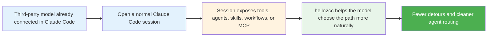

# hello2cc

[](https://www.npmjs.com/package/hello2cc)
[](./LICENSE)
[](https://github.com/hellowind777/hello2cc/actions/workflows/publish.yml)

Make third-party models behave more naturally inside Claude Code.

`hello2cc` does **not** replace your model gateway, provider mapping, or account permissions.  
Its job is simpler:

> If you already connected GPT, Kimi, DeepSeek, Gemini, Qwen, or other third-party models to Claude Code, `hello2cc` helps them notice and use the capabilities that are already available in the current session.

**Language:** English | [简体中文](./README_CN.md)

---

## 🎯 Why use hello2cc?

| Common problem | What hello2cc improves |
|---|---|
| A matching skill or workflow already exists, but the model keeps rewriting the process | Encourages the model to continue with the surfaced or already-loaded workflow |
| The session already exposes MCP resources or tools, but the model still takes a detour | Nudges the model toward the most direct path first |
| Plain parallel workers get confused with team or teammate semantics | Reduces avoidable agent routing mistakes |
| The model can answer, but does not pick the right Claude Code capability | Makes tool, agent, workflow, and MCP usage feel more natural |
| Several plugins are installed and the model receives mixed guidance | Offers a quieter compatibility mode for coexistence |
| The model drifts into verbose meta narration | Keeps responses closer to concise native Claude Code style |

---

## ✅ Best for / ❌ Not for

### ✅ Best for

- You already use Claude Code with third-party models through **CCSwitch** or another mapping layer
- You want those models to behave more like a native Claude Code session
- You have skills, workflows, MCP servers, or plugins installed and want them to be used more reliably
- You want parallel agent work to choose a more appropriate path

### ❌ Not for

- Setting up provider accounts, API keys, or gateway access
- Exposing tools that Claude Code did not expose in the first place
- Replacing **CCSwitch**
- Overriding higher-priority repository rules such as `CLAUDE.md`, `AGENTS.md`, or direct user instructions

---

## 📊 By the numbers

| Item | Value |
|---|---|
| Install flow | 3 steps |
| Extra command required after install | 0 |
| Common config profiles | 2 |
| Main goal | 1 — help third-party models use Claude Code more naturally |

---

## ✨ What it helps with

<table>
<tr>
<td width="50%">

### Skills & workflows

Better continuity when a workflow is already visible or already in progress.

</td>
<td width="50%">

### Tools & MCP

Stronger preference for capabilities that are already available in the session.

</td>
</tr>
<tr>
<td width="50%">

### Agents & teams

Keeps one-shot parallel work on ordinary agent paths, while sustained collaboration is more likely to use a team flow.

</td>
<td width="50%">

### Cleaner interaction

Less unnecessary meta narration and fewer avoidable routing mistakes.

</td>
</tr>
</table>

---

## 🚀 Quick start

### 1) Clone this repository

```bash
git clone https://github.com/hellowind777/hello2cc.git
cd hello2cc
```

### 2) Add the local marketplace

```bash
claude plugin marketplace add "<repo-path>"
```

Replace `<repo-path>` with your local `hello2cc` repository path.

### 3) Install the plugin

```bash
claude plugin install hello2cc@hello2cc-local
```

Then reopen Claude Code or run `/reload`.

### Expected result

- No extra manual entry point is required
- Third-party models are more likely to use session-visible capabilities directly
- Ordinary parallel agents are less likely to be misrouted

---

## 🔧 Recommended configuration

### Option A — Use it with the session as-is

Good when your model mapping is already handled by **CCSwitch** and you just want smoother behavior.

```json
{
  "mirror_session_model": true
}
```

### Option B — Set a stable default agent slot

Good when you want most agents to use the same Claude slot.

```json
{
  "mirror_session_model": true,
  "default_agent_model": "opus"
}
```

If your real target model is mapped through **CCSwitch**, keep the actual mapping there.  
In `hello2cc`, prefer stable Claude slot values such as `inherit`, `opus`, `sonnet`, or `haiku`.

### Option C — Quiet coexistence with other plugins

Good when multiple plugins add extra guidance and the session starts feeling noisy.

```json
{
  "compatibility_mode": "sanitize-only"
}
```

---

## 🔧 How it fits into your workflow



---

## 🛠️ Reinstall / upgrade

If you changed the local repository or want to clean old cache first:

```bash
claude plugin uninstall --scope user hello2cc@hello2cc-local
claude plugin marketplace remove hello2cc-local
claude plugin marketplace add "<repo-path>"
claude plugin install hello2cc@hello2cc-local
```

Then reopen Claude Code or run `/reload`.

---

## 🛠️ Troubleshooting

### The plugin seems inactive

Try these in order:

1. Reopen Claude Code or run `/reload`
2. Confirm the plugin is installed and enabled
3. If you upgraded from a local clone, reinstall it cleanly

### The model still ignores a skill, tool, or MCP resource

Check whether:

1. That capability is actually exposed in the current session
2. A higher-priority project rule or user instruction is restricting it
3. You are continuing the same workflow instead of starting a different one

### Multiple plugins feel noisy together

Use:

```json
{
  "compatibility_mode": "sanitize-only"
}
```

### You still hit `summary is required when message is a string`

Update to the latest version, reload the session, and reinstall if needed.  
Recent versions add a compatibility layer for plain-text `SendMessage`.

---

## ❓ FAQ

<details>
<summary><strong>Does hello2cc replace CCSwitch?</strong></summary>

No. Keep model mapping in CCSwitch. hello2cc focuses on what happens after the model is already running inside Claude Code.

</details>

<details>
<summary><strong>Does it enable tools that Claude Code did not expose?</strong></summary>

No. It only helps the model use capabilities that are already available in the current session.

</details>

<details>
<summary><strong>Do I need to switch an output style manually?</strong></summary>

Usually no. After installation, it should work without an extra manual entry point.

</details>

<details>
<summary><strong>Will it block my existing skills, plugins, or MCP servers?</strong></summary>

No. The goal is the opposite: make those existing capabilities easier for third-party models to discover and use.

</details>

<details>
<summary><strong>Does every multi-agent task become a team?</strong></summary>

No. One-shot parallel work can stay on ordinary agent paths. More sustained collaboration is more likely to use a team flow.

</details>

<details>
<summary><strong>Do I need to set a default agent model?</strong></summary>

Only if you want a stable default Claude slot for most agents. If your mapping is already managed well elsewhere, you can keep the config minimal.

</details>

<details>
<summary><strong>When should I use <code>sanitize-only</code>?</strong></summary>

Use it when multiple plugins are active and you want hello2cc to stay quieter while keeping the most important compatibility fixes.

</details>

---

## 📞 Support

- Issues: https://github.com/hellowind777/hello2cc/issues
- Releases: https://github.com/hellowind777/hello2cc/releases

---

## 📜 License

Apache-2.0
